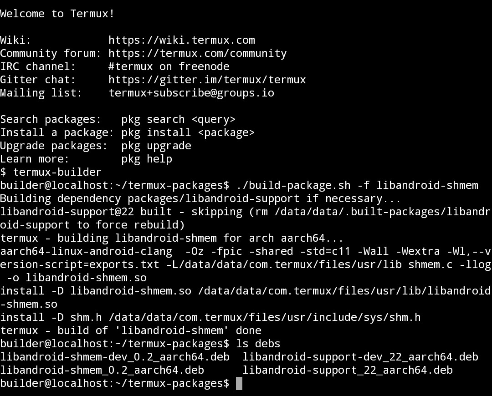

Termux package builder
======================

This is a [termux-packages](https://github.com/termux/termux-packages) build environment that can be used in Termux on device. It consists of Ubuntu, Android SDK and NDK, like the docker image for termux-packages. Since Termux Builder can be used only on x86_64 machines, it use a qemu-user-x86_64 to make possible its usage on all architectures at the cost of performance.

Note: this project was created by request in https://github.com/termux/termux-packages/issues/2914.

<p align="center"></p>

## How to install

To install Termux Builder, follow these steps:

1. Clone repository:
```
git clone https://github.com/xeffyr/termux-stuff
```

2. Run setup script:
```
cd termux-stuff/termux-builder
bash setup-termux-builder.sh
```

Wait until it finishes.

## How to use

Its usage is simple. For example, to build package 'libandroid-support':
```
$ termux-builder
builder@localhost:~/termux-packages$ ./build-package.sh -f libandroid-support
```

Since Termux Builder use QEMU, it will be slow. Building of big packages may take hours (if not days).

To install built packages, do this (in Termux session):
```
cd ~/.termux-builder/home/builder/termux-packages/debs
dpkg -i {PACKAGE_FILE}
```

## Related links

* https://github.com/termux/termux-app
* https://github.com/termux/termux-packages
